# DirectGrow Hub - System Architecture (C4 Level 2)

This diagram illustrates the container-level architecture for the DirectGrow Hub application, showing the key components, their interactions, and the technology stack as specified in the requirements.

```mermaid
C4Container
    title DirectGrow Hub - System Architecture (C4 Level 2)

    Person(distributor, "Distributor (Riya)", "New team member using mobile app for onboarding, training, and lead management")
    Person(teamLeader, "Team Leader (Arjun)", "Manages 20-50 distributors, needs visibility & coaching tools")
    Person(admin, "Admin/Company Ops (Priya)", "Manages content, compliance, and views analytics")

    System_Boundary(directgrow, "DirectGrow Hub") {
        Container(mobileApp, "Mobile Application", "Flutter", "Cross-platform mobile app for distributors and team leaders")
        Container(adminPortal, "Admin Portal", "React.js", "Web interface for company admins to manage content and view analytics")
        
        Container(apiGateway, "API Gateway", "NestJS", "Handles API requests, authentication, and routing")
        
        Container_Boundary(coreServices, "Core Services") {
            Container(userService, "User Service", "NestJS", "Manages user profiles, roles, and permissions")
            Container(trainingService, "Training Service", "NestJS", "Handles training modules, progress tracking")
            Container(leadService, "Lead Management", "NestJS", "Manages leads, follow-ups, and conversions")
            Container(analyticsService, "Analytics Service", "NestJS", "Processes and serves analytics data")
            Container(notificationService, "Notification Service", "NestJS", "Manages all push, SMS, and email notifications")
            Container(communityService, "Community Service", "NestJS", "Handles social learning and community features")
            Container(complianceService, "Compliance Service", "NestJS", "Manages compliance checks and reminders")
        }
        
        ContainerDb(mainDb, "Main Database", "PostgreSQL", "Stores users, training, leads, and operational data")
        ContainerDb(analyticsDb, "Analytics Database", "BigQuery", "Stores processed analytics data")
        
        Container(etlPipeline, "ETL Pipeline", "Python", "Nightly data processing from operational DB to analytics")
        Container(mediaProcessor, "Media Processor", "Node.js", "Processes and optimizes media content")
    }
    
    System_Ext(firebaseAuth, "Firebase Auth", "Handles OTP authentication and optional SSO")
    System_Ext(fcm, "Firebase Cloud Messaging", "Delivers push notifications")
    System_Ext(s3, "AWS S3", "Stores media content")
    System_Ext(cloudfront, "CloudFront CDN", "Delivers media content")
    System_Ext(twilio, "Twilio", "Handles WhatsApp and SMS communication")
    System_Ext(razorpay, "Razorpay", "Processes payments")
    System_Ext(sendgrid, "SendGrid", "Sends transactional emails")
    System_Ext(analyticsProvider, "Mixpanel/PostHog", "Tracks user behavior and events")
    
    Rel(distributor, mobileApp, "Uses")
    Rel(teamLeader, mobileApp, "Uses")
    Rel(admin, adminPortal, "Uses")
    
    Rel(mobileApp, apiGateway, "Makes API calls to", "HTTPS/REST")
    Rel(adminPortal, apiGateway, "Makes API calls to", "HTTPS/REST")
    
    Rel(apiGateway, userService, "Routes requests to")
    Rel(apiGateway, trainingService, "Routes requests to")
    Rel(apiGateway, leadService, "Routes requests to")
    Rel(apiGateway, analyticsService, "Routes requests to")
    Rel(apiGateway, notificationService, "Routes requests to")
    Rel(apiGateway, communityService, "Routes requests to")
    Rel(apiGateway, complianceService, "Routes requests to")
    
    Rel(userService, mainDb, "Reads from and writes to")
    Rel(trainingService, mainDb, "Reads from and writes to")
    Rel(leadService, mainDb, "Reads from and writes to")
    Rel(analyticsService, mainDb, "Reads from")
    Rel(notificationService, mainDb, "Reads from")
    Rel(communityService, mainDb, "Reads from and writes to")
    Rel(complianceService, mainDb, "Reads from and writes to")
    
    Rel(analyticsService, analyticsDb, "Reads from")
    Rel(etlPipeline, mainDb, "Extracts data from")
    Rel(etlPipeline, analyticsDb, "Loads data to")
    
    Rel(apiGateway, firebaseAuth, "Verifies tokens with")
    Rel(mobileApp, firebaseAuth, "Authenticates via OTP")
    Rel(adminPortal, firebaseAuth, "Authenticates via SSO")
    
    Rel(notificationService, fcm, "Sends push notifications via")
    Rel(notificationService, twilio, "Sends SMS/WhatsApp messages via")
    Rel(notificationService, sendgrid, "Sends emails via")
    
    Rel(trainingService, mediaProcessor, "Requests media processing")
    Rel(mediaProcessor, s3, "Stores media in")
    Rel(s3, cloudfront, "Distributes content via")
    Rel(mobileApp, cloudfront, "Streams media from", "HLS")
    
    Rel(leadService, razorpay, "Processes payments via")
    
    Rel(mobileApp, analyticsProvider, "Sends events to")
    Rel(adminPortal, analyticsProvider, "Sends events to")
    Rel(analyticsProvider, etlPipeline, "Exports data to")
    
    UpdateLayoutConfig($c4ShapeInRow="3", $c4BoundaryInRow="1")
```

## Deployment Architecture

The DirectGrow Hub application is deployed using:
- Docker containers on AWS ECS
- Infrastructure as Code via Terraform
- Mobile apps distributed through App Store and Google Play
- CI/CD pipeline for automated testing and deployment

## Multilingual Support

The application supports multiple languages including Hindi and English to cater to the diverse user base in India, with the ability to add more languages as needed.
